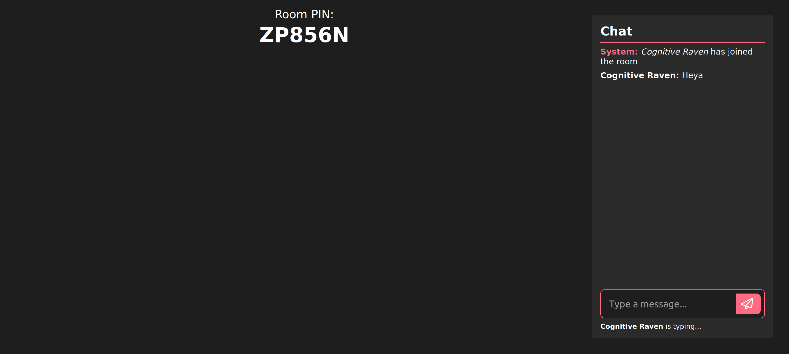

# Real-Time Web @cmda-minor-web 2022 - 2023

Pakkend verhaaltje hier nog

## Table of Contents

- [Features](#features)
- [Week 1](#week-1)
- [Week 2](#week-2)
- [Installation](#installation)

## Features

|        Feature        | Status |
| :-------------------: | :----: |
|   Chat in realtime    |   ✅   |
|   Custom usernames    |   ✅   |
|    Seperate rooms     |   ✅   |
| Create and join rooms |   ✅   |
| Play game(s) in rooms |   🚧   |

## Week 1

In week 1, we started by creating a basic chat-app using the [socket.io library](https://www.npmjs.com/package/socket.io). Using this library, we were able to create a chatroom where multiple users could join and chat with each other.

Building upon this basic socket.io application, I decided to make a web-application where users can create and join rooms to play a game / games together. Currently, I'm not sure what kind of game I want to make, but I'm thinking of something like connect 4 or other board / party games. Inside this game room, users will be able to chat with each other, and play the game together. The game will be played in real-time, so all users will be able to see the game state change as it happens.

Below is some of the client side code for sending messages to the server, and receiving messages from the server.

```ts
const initLobbyMsg = () => {
	msgForm.addEventListener('submit', (e) => {
		e.preventDefault();

		if (msgInput.value) {
			socket.emit('room:msg', msgInput.value);
			msgInput.value = '';
		}
	});

	socket.on('room:msg', (messageObj: iMsgObj) => {
		createUserMessage(messageObj);
	});
};
```

In week 1, most of my time was spent developing the technical aspects of the website. In the coming weeks, I want to spend more time on the frontend / styling of the application. This is what the rooms page currently looks like.

<p align="center">
	
</p>

## Week 2

In week 2, I implemented the [Tenor Api](https://tenor.com/gifapi). Using the Tenor api, users can search for gifs and send them in the chat. The gif will then be displayed in the chat, and all users in the room will be able to see it. To toggle the gif search dialog, I made use of the relatively new `<dialog>` element. This element can be used as a native HTML modal which is great for accessibility.

```html
<dialog>
	<section>
		<label for="gif_search">Search Tenor</label>
		<input
			id="gif_search"
			name="gif_search"
			type="text"
			value=""
			placeholder="Search Tenor" />
	</section>
	<ul></ul>
	<ul></ul>
</dialog>
```

The following dialog can be toggled with Javascript using the `dialog.close()` and `dialog.show()` methods.

## Week 3

## Installation

1. Clone the repository

```bash
$ git clone git@github.com:Laurens256/real-time-web-2223.git
```

2. Navigate to the folder

```bash
$ cd FOLDER-NAME/real-time-web-2223
```

3. Install the (dev)dependencies

```bash
$ npm install
```

4. Start the website in development mode

```bash
$ npm run dev
```

5. Open the website in your browser

```
http://localhost:3000/
```

## License

This project is licensed under the MIT License - see the [LICENSE](LICENSE) file for details.

<!-- Start out with a title and a description -->

<!-- Add a nice image here at the end of the week, showing off your shiny frontend 📸 -->

<!-- This would be a good place for your data life cycle ♻️-->
