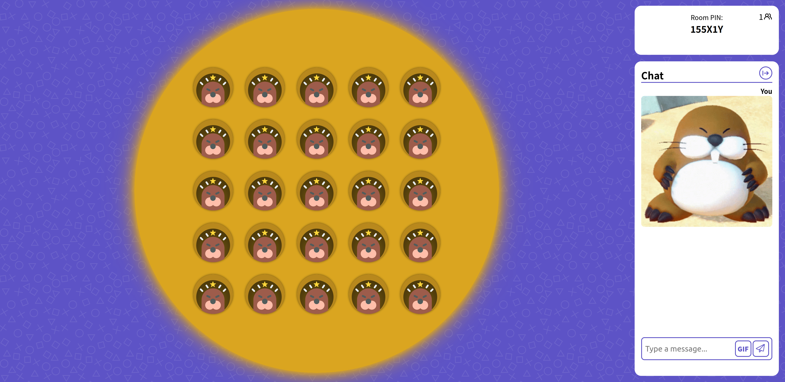
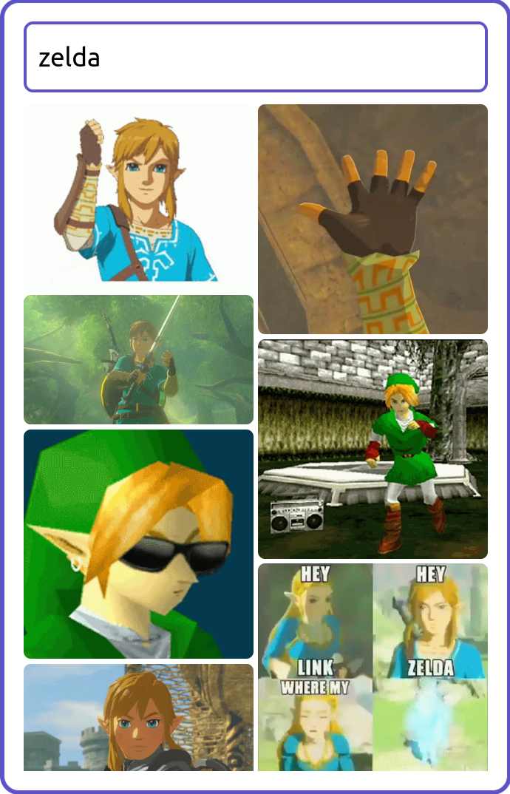
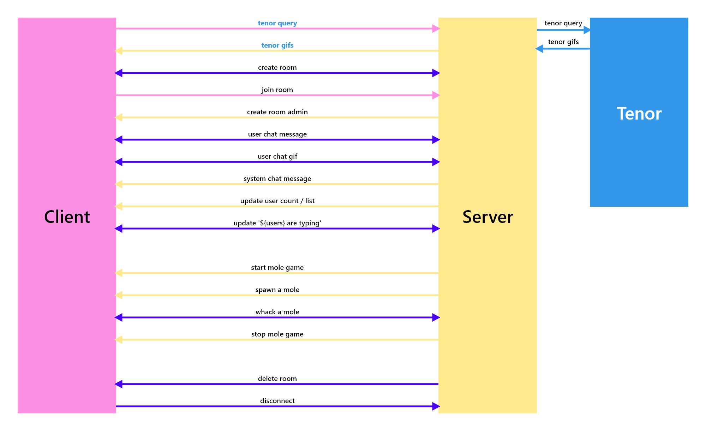

# Real-Time Web - Whack a Mole

<p align="center">
	
</p>

Whack a Mole is a real-time multiplayer game where users can play a game of Whack a Mole with their friends. Users can create and join rooms with a private room code. Users are also able to chat and send gifs in the chat.

## Table of Contents

- [Features](#features)
- [Week 1](#week-1)
- [Week 2](#week-2)
- [Week 3](#week-3)
- [Tenor api](#tenor-api)
- [Data life cycle](#data-life-cycle)
- [Sources / Inspiration](#sources--inspiration)
- [Installation](#installation)
- [License](#license)

## Features

|        Feature        | Status |
| :-------------------: | :----: |
|   Chat in realtime    |   ✅   |
|   Custom usernames    |   ✅   |
|    Seperate rooms     |   ✅   |
| Create and join rooms |   ✅   |
| Search and send gifs  |   ✅   |
|   Play Whack a Mole   |   ✅   |

## Week 1

In week 1, we started by creating a basic chat-app using the [socket.io library](https://www.npmjs.com/package/socket.io). Using this library, we were able to create a chatroom where multiple users could join and chat with each other.

Building upon this basic socket.io application, I decided to make a web-application where users can create and join rooms to play a game / games together. Currently, I'm not sure what kind of game I want to make, but I'm thinking of something like connect 4 or other board / party games. Inside this game room, users will be able to chat with each other, and play the game together. The game will be played in real-time, so all users will be able to see the game state change as it happens.

Below is some of the client side code for sending messages to the server, and receiving messages from the server.

```ts
const initLobbyMsg = () => {
	msgForm.addEventListener('submit', (e) => {
		e.preventDefault();

		if (msgInput.value) {
			socket.emit('room:msg', msgInput.value);
			msgInput.value = '';
		}
	});

	socket.on('room:msg', (messageObj: iMsgObj) => {
		createUserMessage(messageObj);
	});
};
```

In week 1, most of my time was spent developing the technical aspects of the website. In the coming weeks, I want to spend more time on the frontend / styling of the application. This is what the rooms page currently looks like.

<p align="center">
	
</p>

## Week 2

In week 2, I implemented the [Tenor Api](https://tenor.com/gifapi). Using the Tenor api, users can search for gifs and send them in the chat. The gif will then be displayed in the chat, and all users in the room will be able to see it. To toggle the gif search dialog, I made use of the relatively new `<dialog>` element. This element can be used as a native HTML modal which is great for accessibility.

```html
<dialog>
	<section>
		<label for="gif_search">Search Tenor</label>
		<input
			id="gif_search"
			name="gif_search"
			type="text"
			value=""
			placeholder="Search Tenor" />
	</section>
	<ul></ul>
	<ul></ul>
</dialog>
```

The following dialog can be toggled with Javascript using the `dialog.close()` and `dialog.show()` methods.

## Week 3

In week 3 I finally started working on my Whack a Mole game. I decided to go with this game because it's relatively simple to make, and I didn't have a lot of time left. The moles are controlled by the server, and the clients can send requests to the server to "whack" the mole. The client and server both check if the hole is valid, and if it is the user will get a point. The game lasts 40 seconds (might change) and the user who whacked the most moles wins. Below is the server side code responsible for spawning moles

```ts
let currentPlayers = 0;
let moleTimeout: ReturnType<typeof setTimeout>;
const spawnMoles = (holes: number, io: any, socket: any, delay = 1500) => {
	moleTimeout = setTimeout(() => {
		// get a random hole
		const randomHole = Math.floor(Math.random() * holes);

		// if the hole is not active, activate it
		if (!activeHoles.has(randomHole)) {
			activeHoles.add(randomHole);
			io.to(socket.room).emit('room:mole:emerge', randomHole);
		}

		// if the hole is still active after n delay, deactivate it
		setTimeout(() => {
			if (activeHoles.has(randomHole)) {
				io.to(socket.room).emit('room:mole:whack', randomHole);

				// nested timeout so the mole can still be whacked as it's going down
				setTimeout(() => {
					activeHoles.delete(randomHole);
				}, 300);
			}
		}, 1000);

		const delaySubtraction = Math.min(50 * currentPlayers, 150);
		const newDelay = delay - delaySubtraction > 300 ? delay - delaySubtraction : 300;
		// spawn another mole with a shorter delay
		spawnMoles(holes, io, socket, newDelay);
	}, delay);
};
```

The code above will spawn a mole in a random hole, and after a certain amount of time it will despawn the mole if it has not been whacked. The delay between spawning and despawning a mole will decrease over time, making the game harder.

## Tenor api

The Tenor api is used to search for gifs and send them in the chat. Tenor is one of the bigger gif api's, along with [Giphy](https://developers.giphy.com/docs/api/). I chose to use Tenor because it seemed easier to use and I like gifs on there more. The Tenor api endpoint I mostly use in my application is the search endpoint. This endpoint takes a query and returns a list of gifs. To make sure I don't make a request to the api for every letter the user types, I use the following debounce function.

```ts
// set a timeout to prevent the api from being called too often
let searchDelay: ReturnType<typeof setTimeout>;
const searchGifs = async (delay: number) => {
	clearTimeout(searchDelay);
	searchDelay = setTimeout(async () => {
		const query = gifSearchInput!.value;
		if (!query || query.length < 2) {
			return;
		}
		// ...
	}, delay);
};
```

The function above will only call the api if the user has not typed anything for n amount of ms. The reason delay is a parameter, is because sometimes we'll want to call the api immediately. For example when a user presses one of the "recommended" categories.

### Pro tip:

Use a newer version (>= 77) of Firefox with the `layout.css.grid-template-masonry-value.enabled` experimental flag enabled to view the gifs in a cool masonry layout😎.

<p align="center">
	
</p>

## Data life cycle

The data life cycle of a website shows the flow of data through the application. The data life cycle shows how the data flows from the client to the server and back to the client. The data life cycle also shows how and when data from external api's may be fetched. The data life cycle of my application is shown below.

<p align="center">
	
</p>

**Quick summary:** When a user creates a room, a request is sent to the server. The server will then create a room and send a response back to the client with the room code to which the client will be redirected. When the client joins the room, they will be the first to join and will automatically become the room admin. In this room the client can send messages and gifs. When the client sends a message, the message will be sent to the server which will then emit the message to all clients in the room. To send a gif, clients first enter a query which gets passed onto the server and forwarded to the Tenor api. The Tenor api will then return a list of gifs which will be sent back to the client. The client can then select a gif which will be sent to the server and emitted to all clients in the room.

Games can be started with one or more people present in the room. When a game is started by the admin, the server will spawn moles in random holes. The server will then send the hole numbers to the clients which will then spawn the moles on their screen. When a user clicks on a mole, the client will send a request to the server to whack the mole. The server will then check if the hole is valid and if it is, the server will emit the whacked mole to all clients in the room, making it dissapear. When the game is over, the server will emit the scores to all clients in the room. The client will then show the scores and the user with the highest score will be declared the winner.

Of course there's a lot more going on in the application, but this is the general flow of data.

## Socket events

| Event name          | Description                                                                 |
| ------------------- | --------------------------------------------------------------------------- |
| `room:join`         | Used to pass username and room to server                                    |
| `room:join:success` | Used to confirm joining the room was succesful                              |
| `room:join:error`   | Used to indicate joining the room failed (unused)                           |
| `room:update:users` | Used to update the user- count and list of each room                        |
| `room:disconnect`   | Used to emit 'user has left' message                                        |
| `room:admin`        | Used to indicate a new user has been made admin of the room                 |
| `room:msg`          | Used to emit messages                                                       |
| `room:msg:system`   | Used to emit system messages                                                |
| `room:msg:gif`      | Used to emit gifs                                                           |
| `room:typing:start` | Used to indicate a user is currently typing in the chat                     |
| `room:typing:stop`  | Used to indicate a user has stopped typing in the chat                      |
| `room:typing`       | Used to update the list of users that are typing for the clients            |
| `room:game:start`   | Used to indicate the game has started                                       |
| `room:game:stop`    | Used to indicate the game has stopped, also emits the scores to each client |
| `room:mole:emerge`  | Used to emit to the clients that a mole has emerged                         |
| `room:mole:whack`   | Used to update the score and the board of moles                             |

## Sources / Inspiration

- [Tenor API](https://tenor.com/gifapi)
- [Whack a Mole images](https://github.com/0shuvo0/whack-a-mole)

## Installation

1. Clone the repository

```bash
$ git clone git@github.com:Laurens256/real-time-web-2223.git
```

2. Navigate to the folder

```bash
$ cd FOLDER-NAME/real-time-web-2223
```

3. Install the (dev)dependencies

```bash
$ npm install
```

4. Start the website in development mode

```bash
$ npm run dev
```

5. Open the website in your browser

```
http://localhost:3000/
```

## License

This project is licensed under the MIT License - see the [LICENSE](LICENSE) file for details.
